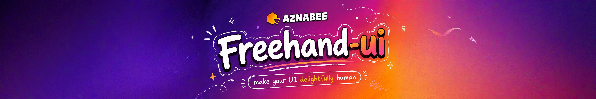
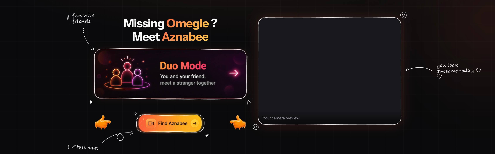
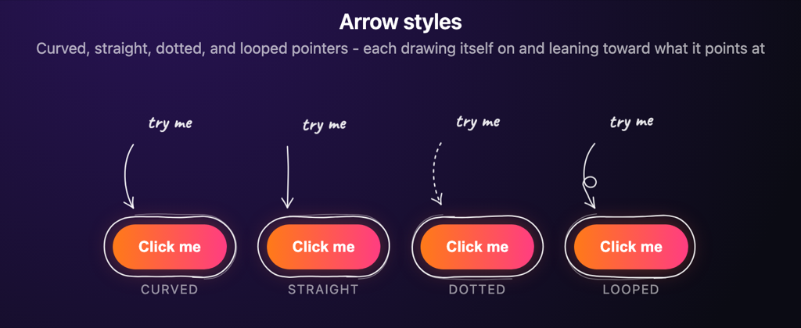
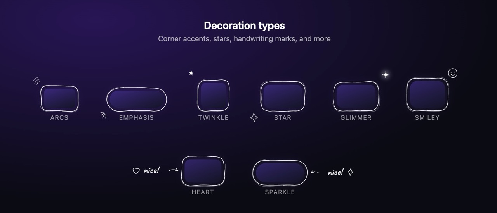

# Freehand-ui

Wrap any existing web element with a beautiful, responsive, hand-drawn doodle layer.

## What it does

`freehand-ui` adds a subtle SVG overlay on top of your UI - thin pen strokes, handwritten notes, arrows, and small decorations. It does not change your element's own styling and never blocks clicks (`pointer-events: none`).

**Good for:** call-to-action buttons, feature cards, onboarding hints, playful marketing UI.

| Feature         | One-liner                                                            |
| --------------- | -------------------------------------------------------------------- |
| **Border**      | Hand-drawn frame that follows the element's shape and border-radius  |
| **Notes**       | Caveat handwriting beside the element                                |
| **Arrows**      | Curved, straight, dotted, or looped pointers that draw themselves in |
| **Decorations** | Corner accents, stars, hearts, and more                              |
| **Localised**   | Notes in the visitor's own language, right-to-left included          |
| **Responsive**  | Stays aligned on resize, scroll, and reflow                          |

**DOM note:** the element is wrapped in a plain positioning `<div>` so the overlay can be mounted beside it (last child, so it paints on top) - the wrapped element keeps its own display and, in a flex/grid parent, its own placement, but a selector depending on it being a *direct* child of its original parent (`.parent > .card`, `:nth-child`) will no longer match. The overlay is also clipped by an `overflow: hidden` ancestor, since it no longer escapes the page via `position: fixed`.

**Live on [Aznabee.com](https://aznabee.com)** - see it in production on the real product.

## 

## Install

```bash
npm install @aznabee/freehand-ui
```

---

## Vanilla JavaScript

Import from the main entry point and call `doodle()` on any element or CSS selector.

### Quick start

```javascript
import { doodle } from "@aznabee/freehand-ui";

doodle(document.querySelector(".card"));
// or
doodle(".card");
```

This draws a hand-drawn border around the element and keeps it aligned as the page resizes, scrolls, or reflows.

### Configuration

Pass a second argument to `doodle()`:

```javascript
doodle(".card", {
  border: true,
  color: "#ffffff",
  strokeWidth: 1.5,
  roughness: 1.5,
  padding: 0, // gap between the element's edge and the frame
  radius: 20, // optional override; auto-detected from CSS when omitted
  opacity: 0.9,
  addBreaks: false, // lift the pen at random points around the outline
  fontFamily: null, // override the handwriting stack
  autoLoadFont: true,
  locale: null, // language for a multilingual note; defaults to the visitor's
});
```

The frame traces the element's own edge by default. Raise `padding` to stand it off - `padding: 8` leaves a comfortable margin around a card.

### Handwriting font

Notes are set in [Caveat](https://fonts.google.com/specimen/Caveat). The library loads it the first time a note is drawn, so handwriting looks right in a plain app with no font setup. Without it, text falls back to the generic `cursive` family (on macOS that's a calligraphic serif, not handwriting).

It skips the request when the page already provides the family, and only ever requests it once. To take over:

```javascript
// self-hosted, or already loaded elsewhere on the page
doodle(".card", { note: "hi", autoLoadFont: false });

// your own family
doodle(".card", { note: "hi", fontFamily: "var(--font-caveat)" });
```

Setting `autoLoadFont: false` without a `fontFamily` falls back to system handwriting faces (Bradley Hand, Segoe Script, Comic Sans MS). Notes are re-measured when a font finishes loading, so the underline always matches the final glyph widths.

### Broken outlines

`addBreaks` cuts randomly sized gaps into the border so it reads as a few confident dashes rather than one closed loop:

```javascript
doodle(".cta", { addBreaks: true });

doodle(".cta", { addBreaks: 5 }); // five gaps

doodle(".cta", {
  addBreaks: {
    count: 4, // omit for 2–5 gaps
    min: 6, // shortest gap, px
    max: 30, // longest gap, px
  },
});
```

Gaps are spread one per section of the perimeter so they never clump, and their total is capped at a third of the outline so the frame still reads as a frame. On small elements the gaps shrink to fit.

### Handwritten annotations

```javascript
doodle(".cta", {
  note: "start chat ♡",
});

doodle(".cta", {
  note: { text: "try me", position: "bottom-right", underline: false },
});
```

**Positions:** `top`, `top-right`, `right`, `bottom-right`, `bottom`, `bottom-left`, `left`, `top-left`. Same names apply to `arrow.from` / `arrow.to`.

Notes are measured from real glyph metrics and laid out so they never sit on top of the element. The underline is drawn to the measured text width; set `underline: false` for plain handwriting.

### Notes in the visitor's language

Write the note once per language and it is drawn in the one the visitor reads - taken from `navigator.languages`, which is what their operating system is set to. No configuration, no i18n library.

```javascript
doodle(".cta", {
  note: {
    en: "start chat",
    "pt-BR": "iniciar conversa",
    hi: "चैट शुरू करें",
    ar: "ابدأ الدردشة",
    default: "start chat", // for languages you have not covered
  },
});

// with the rest of the note's options
doodle(".cta", {
  note: {
    text: { en: "try me", fr: "essaie-moi" },
    position: "bottom-right",
  },
});
```

Keys are BCP-47 tags. Matching follows what the visitor asked for, most wanted language first:

- **Exact tag** - `pt-BR` for a `pt-BR` reader.
- **Less specific** - `zh-Hant-TW` takes `zh-Hant` over a bare `zh`, so the script is only given up after the region.
- **A sibling of the same language** - `en-AU` reads `en-GB` rather than dropping to another language.
- **`default`**, or failing that the first translation written.

Each wanted language is exhausted before the next is tried, so a `fr, en` visitor gets any French on offer ahead of the English original. The page's own `<html lang>` is consulted last, behind the visitor's list.

Take over from the browser - to follow your app's own i18n state - with `locale`:

```javascript
doodle(".cta", {
  note: { en: "start chat", fr: "démarrer le chat" },
  locale: i18n.language, // or a list, in preference order
});
```

Notes are redrawn when the browser fires `languagechange`, so switching language mid-session updates them without a reload.

**Right-to-left** notes need no flag. The base direction is read off the text itself, by its first strong character - the rule behind `dir="auto"` - so an Arabic or Hebrew note is laid out and underlined right-to-left whether it came from a locale map or a plain string.

Caveat itself only ships Latin and Cyrillic. Devanagari, Arabic, CJK and the rest fall through to the system handwriting stack and, past that, to whatever the browser picks - so those notes are legible but not handwritten. Point `fontFamily` at a face that covers your script to keep the handwriting.

### Placement behavior

- **The side you ask for is the side you get.** When a note runs past the viewport edge it slides horizontally by exactly the amount it overhangs, so a narrowing viewport walks it gradually inward instead of snapping to the opposite side.
- **Vertical placement is fixed** relative to the element and does not react to scrolling - a note stays pinned to what it annotates.
- If an element is jammed against the viewport edge, a note may sit partly off screen - use a different `position` or an `offset` there.

Nudge a note with `offset`:

```javascript
doodle(".cta", {
  note: { text: "start chat", position: "top", offset: { x: 40, y: -12 } },
});
```

The offset moves the note from the spot `position` chose. A large horizontal offset slides back into the viewport rather than carrying the note off screen.

### Arrows

```javascript
doodle(".cta", { arrow: true });

doodle(".cta", {
  arrow: {
    from: "top-right", // note | any position name
    to: "center",
    style: "curved", // curved | straight | dotted | looped
  },
});
```



**Styles:** `curved` (default), `straight`, `dotted`, `looped` - `looped` ties a curl into the sweep, crossing the shaft once on the inside of its bow.

Every arc sweeps _over_ the straight line and drops onto its target, the way a hand draws one. With nothing to steer around, that side is fixed rather than picked at random, so a redraw never mirrors the gesture.

**`from`** decides where the arrow leaves:

- **With a note** - names a side of the note (where the pen lifts off the handwriting), then travels to the element.
- **`"note"`** (default) - picks the side of the note facing the element.
- **Without a note** - `from` names a side of the element itself.

```javascript
doodle(".cta", {
  note: { text: "start chat", position: "top-right" },
  arrow: { from: "bottom-left" }, // leaves the note's bottom-left corner
});
```

**`to`:** `"edge"` (default) lands the tip just outside the frame; `"center"` points into the element.

### Arrow animation

Arrows animate by default. Two gestures, both pure CSS:

- **draw** - the shaft is revealed by winding its dash offset down to zero, so the pen appears to travel from the note to the tip. The arrowhead flicks in as the pen arrives.
- **drift** - the whole arrow leans a few pixels along its own line of travel, toward what it points at.

```javascript
doodle(".cta", { arrow: { style: "looped" } }); // both, at defaults

doodle(".cta", { arrow: { animate: false } }); // draw it static

doodle(".cta", {
  arrow: {
    animate: {
      draw: true, // dash sweep along the shaft
      drift: true, // lean toward the target
      speed: 1, // multiplier over every duration - 2 is twice as fast
      duration: 900, // shaft draw, ms, before `speed`
      delay: 150, // wait before the first stroke appears, ms
      distance: 5, // how far the lean travels, px
      driftDuration: 2200, // one full lean-and-return, ms
      repeat: true, // false leans in once and stays there
    },
  },
});
```

`speed` scales every phase at once, so the whole gesture keeps its shape - use it in preference to setting durations individually.

A `dotted` arrow spends its dash pattern on the dots, and one pattern cannot both space them and hide the undrawn tail, so its dots flow toward the tip instead of the shaft being drawn on.

Notes:

- **`prefers-reduced-motion: reduce` turns both gestures off** and leaves the arrow fully drawn.
- The overlay moves with the element for free through ordinary layout - scrolling, a sibling loading in above it - and is only rebuilt when the element's own size actually changes. Animations are placed by how long the overlay has been on the page rather than restarted, so repositioning never replays a draw or jolts a lean mid-cycle.

### Decorations

```javascript
doodle(".card", { decorations: true });

doodle(".card", {
  decorations: {
    count: 2, // border marks, hard-capped at 2
    style: "corners", // corners | sides - omit to pick automatically
    types: ["arcs", "twinkle", "heart"],
  },
});
```



A frame stays readable with **at most two marks around it**. Default composition:

- **one corner accent** - `arcs` or `emphasis` - hugging a corner, aimed outward
- **one corner star** - `twinkle` or `star` - on the corner farthest from it
- **one handwriting accent** - `heart` or `sparkle` - beside the note, not the component

Corner marks follow the _rounded_ corner rather than the bounding box. Marks too large for their gap are pushed further out.

### Handwriting accents

`heart` and `sparkle` are drawn at the far end of the note, on the side away from the element. With no `note` they are skipped rather than moved to the border.

### Small components

Chips and icon buttons get a mirrored pair of two-stroke `emphasis` marks - one either side - instead of corner marks. This is automatic when the element is under 48px on its short side or under 130px wide. `style: "sides"` forces it at any size; `style: "corners"` opts out.

Other types - `star`, `glimmer`, `smiley` - fill a corner slot when no accent or star was requested.

### Child selector mode

Decorate multiple children from a single parent overlay:

```javascript
doodle("#hero", {
  children: ".doodle-item",
});
```

### Lifecycle

```javascript
const instance = doodle(".card");

instance.update(); // recalculate geometry and redraw
instance.destroy(); // remove overlay and disconnect observers
```

Calling `doodle()` twice on the same element replaces the previous overlay - no duplicates.

---

## React / Next.js

Import from `@aznabee/freehand-ui/react`. Every option in the [Vanilla JavaScript](#vanilla-javascript) section works as a prop.

### Component

```jsx
import Doodle from "@aznabee/freehand-ui/react";

<Doodle note="start chat" strokeWidth={2}>
  <Button />
</Doodle>;
```

Ships `"use client"` - drops into the Next.js App Router without a wrapper, and renders on the server without warnings.

The doodle is drawn around **the wrapped component as a whole** - children are never decorated individually. To decorate descendants instead, opt in with `childSelector`:

```jsx
<Doodle childSelector=".card">
  {items.map((item) => (
    <Card key={item.id} className="card" {...item} />
  ))}
</Doodle>
```

### Configuration

Same options as `doodle()`, passed as props:

```jsx
<Doodle
  border
  color="#ffffff"
  strokeWidth={1.5}
  roughness={1.5}
  padding={0}
  radius={20}
  opacity={0.9}
  addBreaks={false}
  autoLoadFont
>
  <Card />
</Doodle>
```

### Wrapper element

`<Doodle>` renders a `<span style="display:inline-flex">` that shrink-wraps its child, so the frame hugs your component instead of stretching to the full width of its container. `inline-flex` specifically: an `inline-block` wrapper adds baseline leading beneath an inline-level child like a `<button>`, which would leave the frame visibly taller than the button.

Override when you need different layout - extra props go to the DOM node:

```jsx
<Doodle as="div" style={{ display: "block" }} className="w-full" note="hi">
  <Card />
</Doodle>
```

Border radius is picked up automatically: if the wrapper has none of its own, it inherits the radius of the child it hugs, so a wrapped pill button is still drawn as a pill.

### Hook

For an element you already hold a ref to, skip the wrapper:

```jsx
import { useDoodle } from "@aznabee/freehand-ui/react";

function Card() {
  const ref = useRef(null);
  useDoodle(ref, { note: "new", decorations: true });
  return <div ref={ref}>…</div>;
}
```

### Handwriting font

With `next/font`:

```jsx
import { Caveat } from "next/font/google";
const caveat = Caveat({ subsets: ["latin"], variable: "--font-caveat" });

<Doodle note="start chat" fontFamily="var(--font-caveat)" autoLoadFont={false}>
  <Button />
</Doodle>;
```

### Localised notes

Same as the core - a map of languages goes straight in as the note, and `locale` hands the choice to your own i18n state:

```jsx
<Doodle note={{ en: "start chat", fr: "démarrer le chat" }}>
  <Button />
</Doodle>;

<Doodle
  note={{ en: "start chat", fr: "démarrer le chat" }}
  locale={i18n.language}
>
  <Button />
</Doodle>;
```

Server-rendered markup is unaffected: the overlay is drawn in an effect, so the language is read on the client and there is nothing to mismatch on hydration.

### React notes

- Inline object props (`note={{ text: "hi" }}`) are compared by value, so a re-render does not tear down and redraw the overlay with a new random seed.
- `disabled` skips drawing entirely - useful behind a reduced-motion check or a feature flag.
- TypeScript definitions ship with the package for both entry points.

---

## Examples

Run the dev server after building:

```bash
npm install
npm run build
npm run dev
```

Then open:

- http://localhost:5173/examples/basic/
- http://localhost:5173/examples/annotations/
- http://localhost:5173/examples/arrows/
- http://localhost:5173/examples/children/
- http://localhost:5173/examples/decorations/
- http://localhost:5173/examples/react/

---

## Design principles

- **Framework agnostic** - plain JavaScript at the core; React is an optional entry point
- **SVG based** - hand-drawn paths, not CSS borders
- **Non-invasive** - `pointer-events: none`, no layout changes
- **Responsive** - absolutely positioned beside the element, so it tracks scroll and layout shifts for free; `ResizeObserver` covers the rest
- **Lightweight** - zero runtime dependencies

---

## License

MIT
